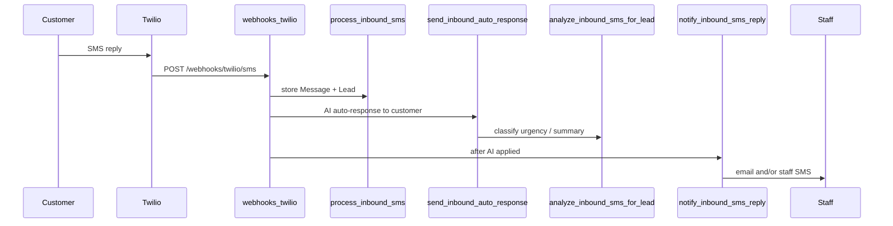

# Live conversation notifications (V1)

Staff alerts when customers text back after a missed call or during an ongoing SMS conversation.

## Flow (production business)

**Order matters:** Staff notification runs **after** `send_inbound_auto_response()` so urgency, summary, and AI temperature reflect the latest inbound message.

**Demo business** (`DEMO_BUSINESS_ID`): uses scripted demo intake only — **no** staff email/SMS notifications.

## Event triggers

| Event | `event_type` | When | Duplicate protection |
|-------|--------------|------|-------------------|
| Missed call | `missed_call` | New voice `CallSid` stored + customer text-back attempted | Same `CallSid` → no second notify |
| Customer SMS reply | `inbound_sms` | New inbound SMS stored + AI reply sent | Same `MessageSid` → no second notify |

## Channels

| Channel | Business field | If blank |
|---------|----------------|----------|
| Email | `notification_email` | Skipped (debug log only) |
| Staff SMS | `notification_phone` | Skipped (debug log only) |

Staff SMS is **not** sent to the same number as the customer (`notification_logs.status = skipped`).

## Staff SMS — inbound customer reply

Compact single-line format (max 320 chars):

- Normal: `LeadCare AI: New reply for {business} from {phone}: '{message}' … View: {url}`
- Urgent: `URGENT LeadCare AI: …` (when urgency is `urgent`/`emergency` or AI temperature is `hot`)

Urgency line included when set and not `normal`/`low`/`unknown`.

Dashboard URL omitted when `PUBLIC_BASE_URL` / `APP_BASE_URL` is not configured.

## Staff SMS — missed call

Multi-line format with urgency, service, town, name, callback, last message, optional recommended action, and dashboard link.

Uses `URGENT LeadCare AI` brand prefix under the same urgent rules.

## Email

**Subjects:**

- `New customer reply: {business}` (inbound SMS)
- `New missed-call lead: {business}` (voice)
- Prefix `[URGENT]` when urgent/hot (both events)

**Body includes:** business name, customer phone, status, source, service needed, summary, urgency, AI temperature, latest message, dashboard link (when configured).

SMTP env: `SMTP_HOST`, `SMTP_PORT`, `SMTP_USERNAME`, `SMTP_PASSWORD`, `SMTP_FROM_EMAIL`. Unconfigured SMTP → `notification_logs.status = skipped`.

## Audit log

Table `notification_logs`: `business_id`, `lead_id`, `channel` (`email`|`sms`), `recipient`, `event_type`, `status` (`sent`|`failed`|`skipped`), `error_message`, `provider_sid`.

Visible on **business lead detail** (`/business/leads/{id}`) under “Staff notifications”, and in admin notification logs.

## Failure behavior

Notification code never raises to webhook handlers. Errors are logged and recorded; Twilio webhooks always return HTTP 200 + empty TwiML for SMS.

## Limitations (V1)

- No browser push notifications
- No quiet hours or escalation rules
- No human live-chat takeover
- Demo business excluded from staff alerts
- Customer-facing auto-reply unchanged by this doc
- Staff SMS requires Twilio + `TWILIO_PHONE_NUMBER`

## Settings UI

`/business/settings` — `notification_email` and `notification_phone` receive alerts for **missed-call leads** and **each new customer SMS reply** while a conversation is active.

## Production vs demo audit

### Are real businesses notified?

**Yes.** Any `Business` with `notification_email` and/or `notification_phone` receives staff alerts when:

1. Twilio `To` matches an **active** row in `phone_numbers` for that business.
2. A new inbound SMS or voice `CallSid` is stored (not a duplicate `MessageSid` / `CallSid`).
3. The business is **not** the configured demo business (`DEMO_BUSINESS_ID`).

`notification_service.py` has **no** demo checks — it only needs `business` + `lead` + configured notification fields.

### Where demo suppression lives (only here)

| Location | What happens for demo |
|----------|----------------------|
| [`app/routers/webhooks_twilio.py`](../app/routers/webhooks_twilio.py) SMS `POST /webhooks/twilio/sms` | If `demo_live_service.is_demo_business_id(processed.business_id)`: runs `demo_intake_service.handle_demo_inbound_sms` only — **does not** call `notify_inbound_sms_reply`. |
| Same file, voice `POST /webhooks/twilio/voice` | If demo business: `send_demo_missed_call_textback` only — **does not** call `notify_new_missed_call_lead`. |
| `is_demo_business_id()` in [`demo_live_service.py`](../app/services/demo_live_service.py) | True only when `business_id == UUID(DEMO_BUSINESS_ID)` from env. |

`is_demo_phone_number()` affects **TwiML voice greeting only**, not notification suppression.

### Business routing

Inbound SMS/voice resolve the business via `phone_number_service.get_phone_number_by_number(db, To)` (`active_only=True`). Unknown or inactive `To` → no lead, no notification.

### Dashboard links

`notification_service._lead_detail_url()` uses `settings.effective_public_base_url` → `PUBLIC_BASE_URL` if set, else `APP_BASE_URL`. Path: `{base}/business/leads/{lead_id}`.

### Dedupe and staff-phone skip

Apply to **all** businesses: duplicate provider SIDs in `process_inbound_sms` / `process_inbound_voice`; staff SMS skipped when `notification_phone` matches customer `lead.phone` (logged as `skipped`).

### Real-product readiness

Ready when each paying customer has: own `Business` row, active `phone_numbers` entry for their Twilio number, `notification_email` and/or `notification_phone`, SMTP + Twilio env configured, and `PUBLIC_BASE_URL` for dashboard links in alerts.
